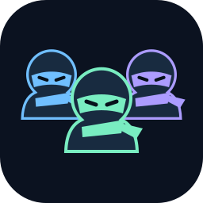
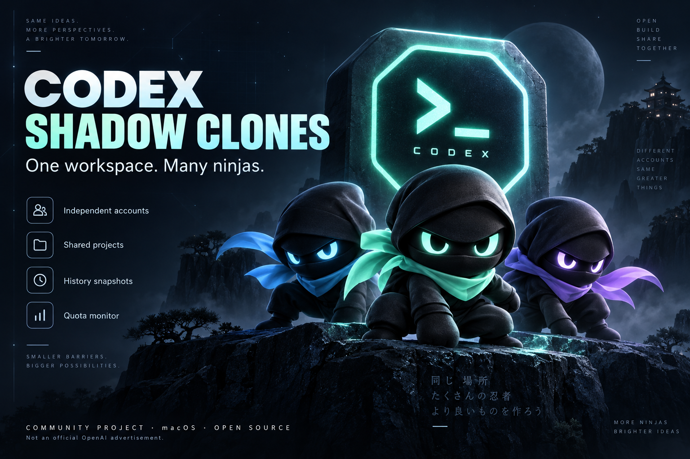

<p align="center"></p>

<h1 align="center">Codex 影分身 · Codex Shadow Clones</h1>
<p align="center"><strong>多个账号，各自就位。同一份代码，随时切换窗口。</strong></p>
<p align="center">macOS · Python + Swift · 本地运行 · MIT</p>



为拥有多个 Codex 账号的 macOS 用户准备的本地多实例管理器。创建 Codex 1、2、3…，各自登录、保留凭据；在菜单栏查看额度，一键前往另一分身。项目代码共享；历史可从所有实例汇总并分发，配置仍是独立快照。

**当前为实验性源码版本**，只适配下表的指定桌面版本。它不合并订阅额度，也不转移正在执行的任务。独立社区项目，与 OpenAI 无隶属或背书关系。

**最新版本：v0.4.2 · 2026-09-24**

[本次更新](#本次更新v042) · [更新安装](#更新到最新版) · [快速开始](#快速开始) · [直接交给 Codex](readme.txt) · [使用与排障](docs/USAGE.md) · [参考项目](docs/REFERENCES.md) · [实现边界](DESIGN.md)

## 本次更新：v0.4.2

- **[新增] 重置卡余量**：在各分身的每周额度下显示官方接口返回的可用次数；未提供时显示“未知”，不会自动使用重置卡。
- **[修复] 备份无限累积**：创建与同步结束后，自动清理较旧的完整数据库和逐条聊天备份；保留每种资源的最新恢复副本，异常目录不自动删除。

完整记录见 [CHANGELOG](CHANGELOG.md)。

## 为什么用影分身

当一个账号额度不足时，另一个已经登录的窗口可以随时打开。你能同时保留原窗口、原账号和正在运行的任务，不必反复整理项目入口。

| 你要做的事 | 影分身提供什么 |
|---|---|
| 移除不再使用的分身 | 退出后删除，完整数据移到本地备份，原实例不可删除 |
| 及时了解新版 | 自动版本检查、手动检查与更新安装说明 |
| 保留多个账号的工作环境 | 每个实例拥有独立 Codex 和 Electron 数据目录；新分身物理 home 默认位于 `~/.codex-shadow/` |
| 切换时不反复登录 | 已登录分身复用自己的凭据；失效后仍需本人重新授权 |
| 不重复添加项目与设置 | 复制项目入口、配置、普通 skills/rules 与部分界面偏好 |
| 多个分身的任务互相可见 | 汇总所有实例已结束历史，向退出的实例分发；运行实例延后 |
| 看清哪个账号还有余量 | 官方 app-server 查询额度、重置时间与可用重置卡次数，默认每 120 秒刷新；服务端未提供次数时显示“未知” |
| 从菜单栏快速前往分身 | 多忍者图标、额度列表、指定窗口聚焦、创建分身 |
| 额度低时提醒自己换窗口 | 可选自动聚焦其他账号，默认关闭，含阈值与冷却 |

没有写死“两账号”上限；可创建多个编号分身，实际数量受机器资源限制。每个分身分别消耗自身账号额度。

## 快速开始

### 环境要求

| 项目 | 当前要求 |
|---|---|
| 系统 | macOS；Linux / Windows 不支持 |
| 桌面应用 | `/Applications/ChatGPT.app`，Bundle ID 为 `com.openai.codex` |
| 已适配版本 | **26.917.71314，build 10954**；不匹配时停止，不绕过版本检查 |
| Python | **3.11+**，仅标准库，无 pip 依赖；当前验证环境为 Python 3.14 |
| 本地编译工具 | Xcode Command Line Tools，提供 `swiftc`、`codesign` |
| 原实例 | 正常安装且已有项目的 Codex；当前默认来源是 `~/.codex` |
| 登录 | 由你本人在官方窗口完成；不要把密码、令牌或回调 URL 发给助手 |

独立实例的 Electron 参数和历史数据库结构不是稳定公开接口。新版本需要重新适配，不能仅改版本常量就视为兼容。

```bash
git clone https://github.com/PKUCY2016/codex-shadow-clones.git
cd codex-shadow-clones
python3 --version
xcode-select -p
python3 scripts/preflight.py
python3 -m unittest discover -s tests -p 'test_shadow*.py' -v
python3 launch_shadow.py
```

`python3 scripts/preflight.py` 只读检查系统、依赖、精确桌面版本与必要素材；失败时先解决缺项，不绕过版本检查。

没有编译工具时，先用 `xcode-select --install` 安装。启动会本地编译菜单栏应用，并打开带访问令牌的管理面板。之后可双击仓库中的 **Codex影分身.command**。

1. 打开原 Codex，再在面板点击 **创建分身**；首次历史导入可能需要等待。
2. 在新窗口登录另一个账号，等待额度刷新。
3. 点击 **切换到此窗口**，确认进入正确分身。
4. 要更新历史或配置时，先用 ⌘Q **退出目标分身**，再更新并重新打开。关掉窗口不一定退出应用。

直接访问 `http://127.0.0.1:18318` 可能显示 Unauthorized。请通过启动器或菜单栏打开面板，不手工复制访问令牌。

## 删除分身

先在目标 Codex 分身按 **⌘Q** 退出，再点击该卡片的 **删除分身** 并确认。运行中或无法确认运行状态时不允许删除；原实例没有删除按钮。

删除会从管理列表移除分身，将整个数据目录移动到私有 `.runtime/deleted-clones/`，并保存包含原路径与注册信息的恢复记录。它保留账号、配置和历史，**不会立即释放这些数据占用的磁盘空间**。共享项目代码和已同步到其他实例的历史保留。新建分身使用新编号，不复用旧数据。

需要恢复时按 [使用与排障](docs/USAGE.md#删除与恢复) 处理；不要把私有备份上传到 GitHub。

## 更新到最新版

从 v0.3.0 起，启动后及每 6 小时自动检查新版；也可以在面板或忍者菜单中选择 **检查软件更新**。发现新版后点击 **查看新版与安装说明**。只读取本仓库的公开版本清单，不发送账号信息、不自动下载执行代码；断网只影响更新检查。

**早期版本没有版本检查能力，需要先手动更新一次。** 在原仓库目录运行 `git status --short`；有本地修改时先保存提交，确认可以合并后再更新，不要强制覆盖。

```bash
git pull --ff-only origin main
python3 scripts/preflight.py
python3 -m unittest discover -s tests -p 'test_shadow*.py' -v
python3 launch_shadow.py --restart
```

`--restart` 在新菜单栏编译成功后，重启本仓库的管理服务与菜单栏，不退出任何 Codex 分身。创建或同步进行中会拒绝重启；额度查询繁忙时短暂等待。更新完成后用启动器新打开的面板，旧页面的访问令牌可能已失效。更新前不必删除 `.runtime`，它保存你的分身数据。

### 让 Codex 帮你安装

打开本仓库，将下面一段发给 Codex，或直接提供 [readme.txt](readme.txt)：

> 请读取本仓库 README.md 和 readme.txt，按其中的检查、测试、启动步骤安装 Codex 影分身。先核验 macOS、Python、Swift 与指定 Codex 桌面版本；版本不符请报告，不能移除检查。不要读取或输出凭据、私人会话内容，不关闭正在运行的任务。检查通过后运行离线测试并启动管理面板；首次登录由我本人完成。最后报告实际完成项和仍需我操作的步骤。

## 共享与隔离

| 数据 | 行为 |
|---|---|
| 项目代码 | 打开原来的本地目录，文件修改立即共享；并行工作需避免改同一文件 |
| 项目列表 / 配置 | 创建时复制，之后手动同步；被覆盖配置有本地备份 |
| 账号凭据 / Electron 数据 | 每个分身独立，创建时不复制原账号登录 |
| 历史聊天 | 多源汇总已结束快照，运行目标退出后补齐；分叉独立保留 |
| 侧边栏 / 置顶 | 导入相关快照；历史更新保留目标的归属与排序字段 |
| 运行中的回合 | 留在原实例；快照仅包含已结束或中止的回合 |
| 第三方插件登录 / Cookie | 不复制；插件需在目标实例确认可用性和连接状态 |

配置导入会带入插件启用项，并复制本地记忆快照与暂停的自动化模板，但不会复制整个插件缓存；符号链接 skills 不展开。它不是完整应用备份；历史汇总有延迟，不对运行中的界面热写入。

## 分身能力兼容性

项目与偏好可复制，工具连接、系统权限和账号能力仍需分别核验。
运行 `python3 scripts/check_clone_capabilities.py` 可得到脱敏配置诊断；
Computer Use 会同时检查顶层与插件内服务。自动化以暂停模板复制，记忆以本地 Markdown/JSONL 快照复制。
详见 [兼容性与验证边界](docs/COMPATIBILITY.md)。

## 多个实例统一同步历史

面板或菜单栏点击 **统一同步历史**。Codex 1、2、3… 都是来源，也都可以接收其他实例的历史。

- 不同任务互相补齐。同一任务的连续追加按日志前缀快进，不按更新时间盲目覆盖。
- 普通完整日志发生分叉时，保留独立任务副本，并用官方离线迁移建立索引；不把两条对话拼成一条。
- 运行中的实例只读采集，不写入、不重启；目标退出后监控会尝试补齐（约120秒检查一次）。未结束的目标回合仍保留。
- 开启 **定期汇总历史** 后约5–6分钟检查一次；默认关闭。未结束的源回合要等结束后才能同步。
- 分页/祖先依赖型历史暂不参与多源自动合并，显示“不支持”；创建新分身时仍可导入原实例的历史快照。结果为 partial 时不能理解为已完全同步。

历史汇总位于私有 `.runtime/history-hub`，不是共享的运行数据库。保留最近两批采集快照，未变化日志复用归档副本，分叉另存保留。账号、配置、置顶与运行任务不做多源覆盖。通过本管理器串行操作；同步时不要绕过管理器手动启动目标桌面或外部 CLI，避免进程检查后的竞争。

每次创建分身、同步历史或配置后，管理器会清理分身 `.shadow-backups` 中较旧的可识别备份：历史数据库保留最新完整一份，逐条聊天文件按任务各保留最新一份；侧边栏、项目归属和插件市场配置备份各保留最新一份。旧版数字命名、不完整或无法识别的目录不会自动删除；已删除分身的恢复归档和历史 hub 不受此规则影响。

## 自动切换具体做什么

默认关闭。开启后监控**面板最后选中的分身**，不是操作系统实时前台窗口。默认阈值 10%，可设置 0–90%；只选择不同账号、最近 5 分钟内成功读取且主额度高于阈值的分身，成功后冷却 10 分钟。

“切换”指打开或聚焦另一个窗口。它不会把当前任务发送到另一账号，不自动输入“继续”，也不迁移工具进程或模型缓存。额度未知、读取失败、没有合适候选时不假定账号可用。

## 验证范围与已知限制

离线回归测试覆盖删除与恢复、版本比较、更新重启、额度解析、超时、账号筛选、冷却、进程识别、项目导入、快照刷新与侧边栏保留。开发时还检查过真实账号额度读取、窗口聚焦和部分历史的官方接口读回。已验证多源补齐、分叉去重、运行目标保护，并用官方接口读回隔离测试的分支；测试数量以当前测试输出为准。

仍未完成真实额度耗尽后的自动切换验收；不能据离线测试宣称所有账号与桌面版本兼容。历史导入可能返回 partial：缺失源文件、无法识别的历史依赖会跳过并统计；已遇到部分大体积旧历史保留日志但官方分页显示为空的情况。不要把快照当作唯一备份。

菜单栏应用在本机构建并 ad-hoc 签名，未提供 Apple 公证安装包。暂无开机自启。退出菜单栏仅关闭菜单入口，后台监控与桌面实例仍运行。详见 [使用与排障](docs/USAGE.md)。

## 隐私与费用

管理服务只监听 `127.0.0.1:18318`，使用本地访问令牌并检查 Host / Origin。分身状态、凭据、快照、配置备份都在本机 `.runtime/`，不要上传或分享该目录。源码不包含账号，也不要求把凭据交给项目维护者。

额度查询不发起模型生成请求；真正聊天仍由官方应用连接服务并消耗各自账号额度。源码免费使用，账号订阅由你自行管理。多个应用实例会增加内存与磁盘占用，未给出固定资源上限。项目不改变服务本身的登录、地区或账号可用条件。

## 参考与新增实现

| 参考 | 借鉴部分 | 影分身的实现 |
|---|---|---|
| [liuzhao1225/codex-account-switcher](https://github.com/liuzhao1225/codex-account-switcher) | 通过官方 app-server 获取身份、额度的方式 | 对每个独立分身查询，管理多窗口状态 |
| [lordydord/Codex-Account-Switcher](https://github.com/lordydord/Codex-Account-Switcher) | 低额度阈值、冷却、可用账号选择思路 | 可选自动聚焦另一分身，保留原实例运行 |
| [OpenAI App Server](https://learn.chatgpt.com/docs/app-server) | 官方账号、额度和项目协议 | 调用桌面自带组件，使用本地适配层 |

本项目独立编写，没有复制上述两个切号项目源码，也不是它们的 fork。新增重点是**多个独立桌面实例、共享项目路径、配置导入、可更新历史快照与冲突保留**。参考关系、固定提交及 README 结构来源见 [REFERENCES.md](docs/REFERENCES.md)。

## 开发与贡献

| 文件 | 职责 |
|---|---|
| `shadow_clones.py` | 本地服务、实例生命周期、切换选择 |
| `shadow_updates.py` / `version.json` | 公开版本检查与版本号 |
| `launch_shadow.py` / `shadow_reload.swift` | 启动和更新后的管理服务重载 |
| `shadow_quota.py` | 官方额度与身份查询 |
| `shadow_seed.py` | 配置、项目与界面状态导入 |
| `shadow_history.py` / `shadow_history_state.py` | 历史快照、依赖与侧边栏 |
| `shadow_dashboard.html` | 本地管理面板 |
| `shadow_menubar.swift` / `build_menubar.py` | 原生菜单栏与本机构建 |
| `tests/test_shadow*.py` | 离线回归测试 |

提交问题时提供系统、应用版本、Python 版本、操作步骤及脱敏错误。请勿附上 `.runtime`、账号文件或私人聊天。修复需说明触发条件、数据保留方式和相应回归验证。后续优先方向是新桌面版本适配、旧历史分页兼容、真实自动切换验收及更便捷的安装方式；这些不是当前已实现承诺。

## 许可证

[MIT](LICENSE)。OpenAI、Codex 等名称及相关标识属于各自权利人，不代表官方授权或背书。
